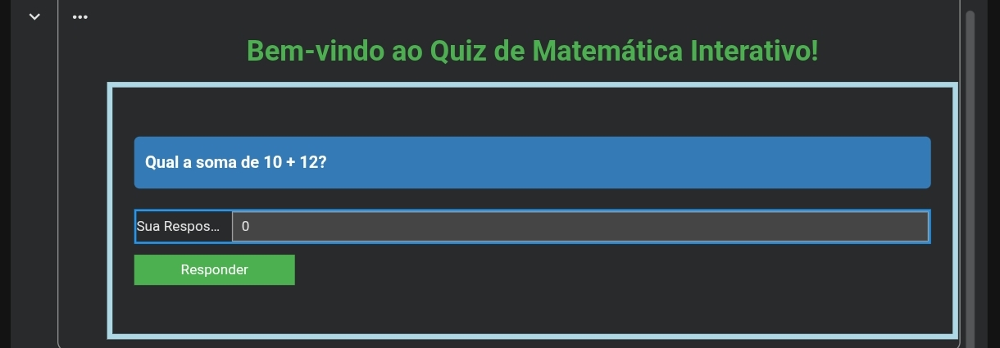

# Quiz de Matemática em Python

⚠️ Observação:

O arquivo `quiz_interativo.ipynb` utiliza `ipywidgets`.
A visualização correta do projeto interativo ocorre no Google Colab.
No GitHub, o notebook pode apresentar marcações em vermelho, o que é esperado.

Projeto desenvolvido para praticar lógica de programação em Python.
O projeto possui duas versões:

## 📌 Versões

### 🔹 Quiz Interativo (Google Colab)
Interface gráfica utilizando ipywidgets.

[](https://colab.research.google.com/drive/1d43z1_ZkLjS0odzFik1KJfT2ryDJO4mK?usp=sharing)

### Visualização do Projeto:


### 🔹 Quiz em Terminal
Versão executada no terminal usando input/output.

▶ Executar localmente:
```bash
python quiz_terminal.py


